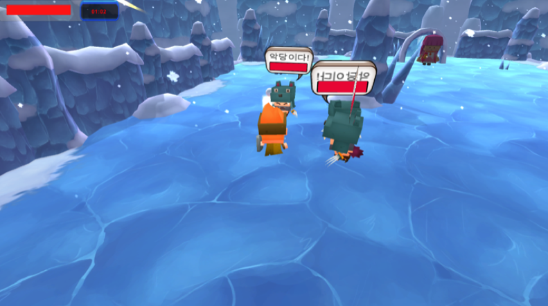
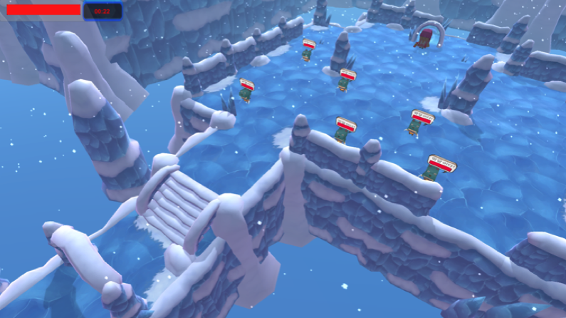

# go-prince



## 소개
`악당들을 물리치고 공주를 구하러 가는 왕자가 주인공인 Unity 게임`입니다.

## 개발환경


## 주요코드
```csharp
// 생명주기인 Start 에서 오브젝트의 컴포넌트를 저장합니다.
void Start () {
    ...
    badGuyTr = this.gameObject.GetComponent<Transform>();
    ...
}
```

```csharp
/*
    충돌 처리 코드입니다.
    충돌이 일어나면 OnCollisionEnter -> OnCollisionStay -> OnCollisionExit 이 트리거됩니다.
    오브젝트를 제거하는 방법은 Destroy(object)입니다.
*/
void OnCollisionEnter(Collision coll) {
     if(coll.collider.tag == "SNOW") {
        Debug.Log("SNOW와 충돌했습니다.");
        Destroy(coll.gameObject); // 층돌한 눈덩이 제거
        if (++hitCount >= 3) ChangeGauge();
    }
}
```

```csharp
/*
    unity의 생명주기 중 하나인 update는 FPS가 60이라면 1초당 60번 프레임이 그려질 때마다 호출되는 함수입니다.
    update의 호출 주기를 수정할 수 없으며 다양한 요인으로 조정됩니다.
    따라서 내가 원하는 호출 주기를 정하고 싶다면 StartCoroutine() 함수를 사용해야 합니다.
*/
void Start () {
    ...
    StartCoroutine(this.CheckBadGuyState());
    ...
}

IEnumerator CheckBadGuyState() {
    while(!isDie) {
        yield return new WaitForSeconds(0.2f);
        ...
    }
}
```
